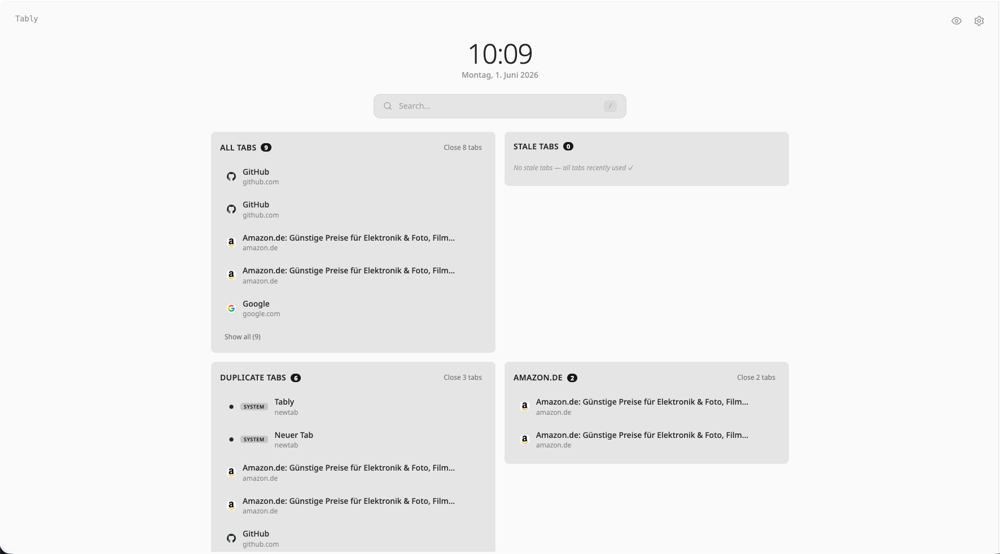
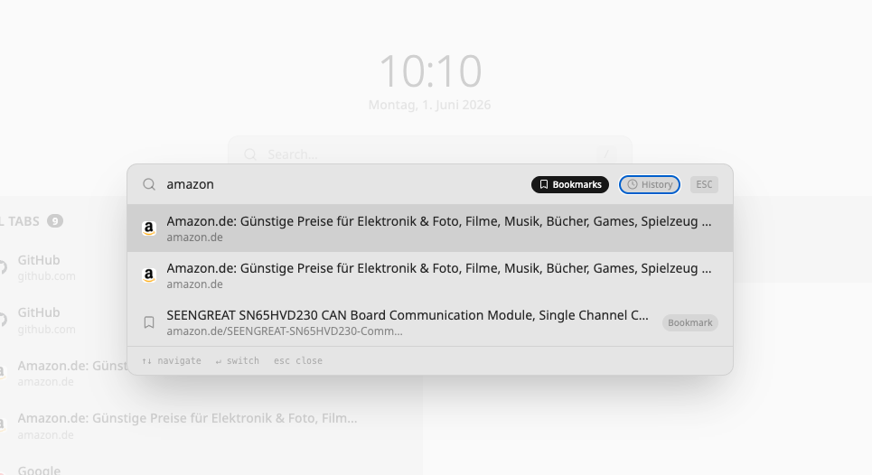
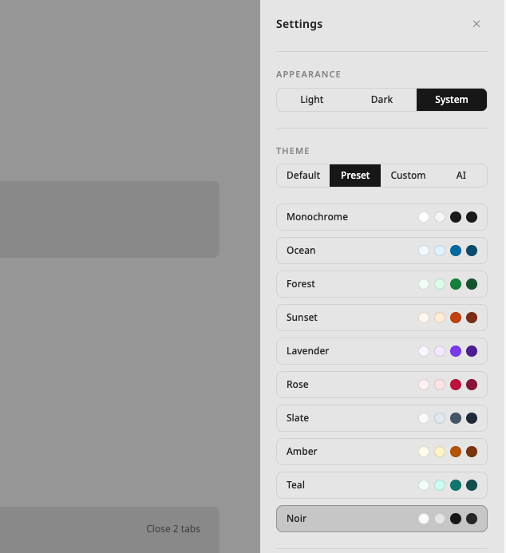

# Tably

[](https://ko-fi.com/J3G820LBTF)

[](https://chromewebstore.google.com/detail/tably/acnbdinebifelgdihaakonbnfpllfoch)


A fast, minimalistic new tab page that puts your tabs front and center. No clutter, no distractions — just instant access to everything you need. Built for efficiency with zero loading overhead.



## Features

- **Instant tab search** — press `/` or `Ctrl+Shift+F` (`Cmd+Shift+F` on Mac) to fuzzy-find any open tab, bookmark, or history entry in milliseconds
- **Tab management** — view, switch, and close tabs directly from your new tab page. Detects duplicates and stale tabs automatically
- **Bookmarks & history** — search across all your bookmarks and browsing history without leaving the page
- **Lightweight** — no external requests on load, no analytics, no bloat. Opens as fast as an empty tab
- **Customizable themes** — 10+ preset color themes, light/dark/system mode, or create your own

### Search

Press `/` to open the unified search. Filter by tabs, bookmarks, or history — navigate with arrow keys, switch with Enter.



### Themes

Choose from presets like Ocean, Forest, Sunset, or Noir — or build a fully custom palette.



## Development

```bash
npm install
npm run dev
```

## Build

```bash
npm run build
```

Load the `dist/` folder as an unpacked extension in Chrome.


## License

MIT — see [LICENSE](./LICENSE).
